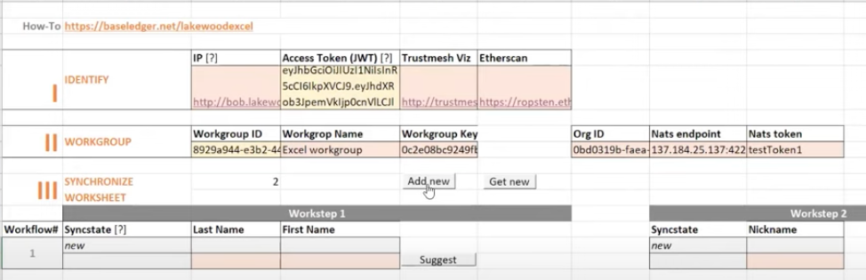

# Baseline Protocol のビジネスアプリケーションへの適用とその利用へのアプローチ

履　歴

2022-03-10 &nbsp;&nbsp;&nbsp;&nbsp;	Draft 1	
		

目　次

```
0. はじめに
1.	Baseline Protocol
1.1	目的と位置付け
1.2	Baseline Protocol Specification V1.0
1.3	実装例（利用例）
1.4	コミュニティ
2.	Baseledger
2.1	Baseledgerの位置付け
2.2	Baseledgerの構成と動作
2.3	いくつかのトピックス
2.4	実施例
2.5	組織・運営
3.	利用へのアプローチ
```

<br>  
# 0. はじめに

Enterprise Blockchainの一環としてEY（Ernst & Young）とConsenSys が2020年に開始したBaseline Protcol Initiativeは、サイロ状態にある各企業のERPを、ブロックチェーンを介した「疎結合」を通して、データ連携を図ることを目的とした。その後、Oasis FoundationとEnterprise Ethereum Alliance （EEA）の共同プロジェクトに所管が移り、2021年11月にBaseline Protocol Specification V1.0 が発表されている。

Baseline Protocolはビジネスプロセスを同期（データ連携）するためのフレームワークとして位置付けられ、かつ、プライバシー（企業秘密）を開示しない場合はゼロ知識技術（ZKP）を利用することができる。
Baseline Protocol の採用はまだまだ進んではいないが、当仕様に準拠した参考実装（Reference Implementation）がいくつか提案されている。また、参考実装を超えた製品化事例（Baseledger）も出現している。

一方、サプライチェーン・ソリューションはこれまでにも、ブロックチェーンを使わないでも実現されているが、分散システムを利用し、かつ「監査可能」なシステムを構築するという観点からブロックチェーンを利用したソリューション開発が進められてれてきている。Hyperledger Fabric をベースにしたシステムがその代表例であるが、それらは新規のシステムを構築するものであった。

上述したようにBaseline Protocolは、企業内の既存のERPなどのSoR（System of Record）に変更を加えずそのまま使用しながらも、企業間でデータ連携を図るものであるので、より広範囲なサプライチェーン・ソリューションを構築することができる。本レポートでは、Baseline Protocol（第１章）、その実装であるBaseledger（第２章）のポイントを紹介するとともに、サプライチェーン・ソリューションとして利用する場合の検討すべき課題（第３章）について議論する。


<br>  
#１．	Baseline Protocol
##1.1	目的と位置付け

“Baseline Protocol” の目的・位置づけとして次のように宣言している。

”The Baseline Protocol is a framework that enables enterprises to synchronize complex, multiparty, business processes with privacy and without moving data from systems of record.
Zero Knowledge circuits employ a common frame of reference that allows all parties in a networked business process to maintain their own systems-of-record in a verified state of consistency. Public blockchain is advised but not required. ”
&nbsp; &nbsp; 出典： ”The Standard for Universal Verified State Synchronization & Multiparty Coordination Using Zero Knowledge”  (https://www.baseline-protocol.org/)

Baseline Protocolはビジネスプロセスを同期（データ連携）するための**フレームワーク**。ビジネスを行うパートナーにも、プライバシー（企業秘密）を開示しない場合はZero Knowledge技術を利用
企業内ではERPやCRMなどが稼働しているが、企業間でこれらを同期する標準は存在していない。それを可能にする共通のフレームワークが　Baseline Protocolであり、**監査可能なフレームワーク**とするためにブロックチェーンを使用する。

経緯： 2020年3月にEY（Ernst & Young）とConsenSysがMicrosoftの協力のもとにBaseline Protocol Initiative を発表、現在ではOASIS FoundationとEnterprise Ethereum Alliance（EEA）の共同プロジェクト、およびコミュニティで標準化の開発が進められている。

EY and ConsenSys Announce Formation of Baseline Protocol Initiative に記事あり。
https://consensys.net/blog/press-release/ey-and-consensys-announce-formation-of-baseline-protocol-initiative-to-make-ethereum-mainnet-safe-and-effective-for-enterprises/?utm_campaign=ConsenSys%20Newsletter&utm_source=hs_email&utm_medium=email&utm_content=

<br> 
## 1.2	Baseline Protocol Specification V1.0

Baseline Protocol Specification V1.0 が2021年11月に発表されている。

	•	documentation: https://docs.baseline-protocol.org/
	•	github repo: https://github.com/eea-oasis/baseline-standard

これは以下を含んでいる。

	•	Core Specification (https://docs.baseline-protocol.org/baseline-protocol-standard/core-specification)
	•	API Specification （https://docs.baseline-protocol.org/baseline-protocol-standard/api-specification）
	•	CCSM Specification（https://docs.baseline-protocol.org/baseline-protocol-standard/ccsm-specification）
	CCSM: Consensus Controlled State Machine. P2PでDecentralized systemを可能にするネットワーク。

これらのSpecificationで使用される語彙についてはGlossary （https://docs.baseline-protocol.org/baseline-basics/glossary）を参照。

Architecture LayerのReference（参照）として、
BPI Abstraction Layer、 
Middleware Layer、
Processing Layer、
CCSM Abstraction Layer、および
CCSM Layer を定義している。
詳細はhttps://docs.baseline-protocol.org/baseline-basics/architectureを参照。

<br> 
## 1.3	実装例（利用例）

Baseline Protocol Specification V1.0が発表される前から、Baseline Protocolが試行されている。

```
•	CONA:  Baselining the North America Coca-Cola Bottling Supply Chain. 
	Coke One North America (CONA), the IT platform for Coca-Cola’s North American bottling business

•	E&Y OpsChain Network Procurement solution
```
	
### 1.3.1 Baseline Reference Implementation
Baseline Reference Implementation（BRI）として以下が開発されている。 BRI とは Baseline Protocol Specificationに準拠した実装例。これをべースにすればアプリケーション開発が迅速・容易になると期待される。
https://docs.baseline-protocol.org/bri/overview-of-reference-implementations

### ・BRI-1:  
特徴は  To Be Supplied

###	•	BRI-2:　
特徴は  TBS

### 1.3.2 Connectorの実装：　
社内のレガシーシステムと接続する場合には Connectorが提供される。対応するシステムによっては新たに準備する場合もあろう。

###	•	SAP/Microsoft Dynamics
SAP/ERPとMicrosoft Dynamics 365
データ連携のプロセスとフォーマット：　TBS

###	•	Google Sheets/Microsoft Dynamics
Baseline Integrates Microsoft and Google Spreadsheets Using Ethereum Mainnet
データ連携のプロセスとフォーマット：  TBS

###	•	MSFT Excel Connector（Baselineでは予定。Baseledgerを参照）

###	•	WorkflowシステムとのConnector （未提供。Baseledgerを参照）

<br> 	
## 1.4	コミュニティ

オープンソースのBaseline Protocolはコミュニティで運営されている。
コミュニティのリーダーとして、
Project Governance Board、
Technical Steering　Committee、
Core Development Team、
Standard Team、
Outreach Teamが設置されている。
これは最近のブロックチェーン業界で主流となっているFoundationのgovernance方式と同様である。

なお、2020年のBaseline Protocol Initiativeの創設メンバーは
AMD、EY、ChainLink、Core Convergence、ConsenSys、Duke University、Envision Blockchain、MakerDAO、Microsoft、Neocova、Splunk、Unibright、Provide、W3BCLOUD。

<br> 
# ２．	Baseledger

Baseline protocol のユースケース：　
•	baseledger-excel
•	battleship
•	bpi-monolith-test-suite
•	bri-1
•	bri-2
•	financialcircuit:  ZKPを利用
https://github.com/eea-oasis/baseline/tree/main/examples を参照。

このうち、baseledger-excelのベースであるBaseledgerが現時点で一番整備されているBRI（Baseline Reference Implementation）である。

<br> 
## 2.1	Baseledgerの位置付け

BaseledgerはUnibright（ドイツFrankfurt近郊）がProvide（米国Atlanta）と開発しているBaseline Protocolの実装であり、アプリケーション開発のためのフレームワークである。
Web: https://baseledger.net/
Documentation: https://docs.baseledger.net/
https://unibright.io/
https://provide.services/

Unibrightは Baseledgerの開発とともに、企業ブロックチェーンのソリューション開発のための統合化ツール、DeFiソリューション、コンサルティングサービスを実施している。

Unibrightと Provideはともに Baseline Protocol Initiativeの創設メンバーであり、コミュニティのTechnical Steering Committeeに席を有している。Provideは Core Development Team、Standard Team、Outreach Teamにも参加している。（2022/2/28現在）

Baseledgerの内容、機能、Ethereumとの比較などについては上記の https://baseledger.netのNEXT-GEN ENTERPRISE LEDGERに記載されている。

一方、Baseledgerの技術的な内容、目標、コンセプト、利用方法とUsecaseについては https://docs.baseledger.net/ に詳しく記述されている。

Baseledgerをどのように利用できるかを検討するために上記の Baseledgerの Documentation（https://docs.baseledger.net/）を参照しよう。

<br> 
## 2.2	Baseledgerの構成と動作
Baseledgerは企業活動を（当然で、自然でもあるが）Workflowで捉えている。図2-1の真ん中の２つの箱にBaseledgerの動作環境を見ることができる。

協業する企業間でWorkgroupを構成。図ではWorkgroup 1: Supply Chain Network とWorkgroup 2:Invoice Financingが例示されている。企業組織Org1は Workgroup 1に属し、Org3は Workgroup 1とWorkgroup 2の双方に属している。

<br> 


**図2-1　Baseledgerのアーキテクチャ**
出典: https://docs.baseledger.net/baseledger-introduction/abstract
<br> 

企業組織間では、Workflowを開始するときの認証（Authentication）と契約内容などを Proof（証明書）として Message交換する。と同時にデータ連携（同期）のために Baseledgerとやりとりする（Baselining）。

Baseledgerは Storageと CCSM（Consensus Controlled State Machine）を持つ Layer-2のブロックチェーンであり、Layer-1のブロックチェーン（上図ではEthereum）にトランザクションやスマートコントラクトを書き込む。

図2-1の BaaSとして提供される Unibrightや Provideの機能モジュール、Baseledgerから Exitした後に利用できる Defi機能が掲載されているが、ここでは省略する。

その動作手順を図2-2に示す。Org1の Aliceと Org2の Bobとの間で Workflowを実行する。SoR（System of Record）は Org1の社内システム（ERPなど）。BaaS Stackは Baseledgerに含むモジュールなどの機能。Layer 1、Baseledger、Layer 2は前出。

Workflowの実行に先立って、Initialization（の箱）で Orgの登録、Workgroupの登録、Workflowの定義と登録を行う。

Worksteps（の箱）で Workflowの実行状況が示されている。
Domain Objectは契約内容など、データ連携をする対象。
Aliceが生成し、署名を加えて Baseline Protocolを利用して Bobに送出（Signed Baseline Message）。BobはObjectの内容を確認し、フィードバックを署名つきで返す。
Aliceはフィードバックを検証するが、ここでは ZKP（Zero Knowledge Protocol）を利用した検証をしている。
検証された Workstep内容は Layer1に格納されるとともに、Baseledger経由で Proofとして企業間で同期する。

一つの Workflowには通常複数の Workstepが含まれているので、当該 Workflowが完了するまで繰り返す。

Exit（の箱）は Workflowの最終のステップが実行された時を示す。
Exitした後は、Baseledgerの外で（または協業して）、Final Stateを基点として Defiなどの別のアプリケーションを実行。
例えば、サプライチェーンで生産工程が完了した後に、１次、２次販売システムにつなげた場合などを想定することができる。

<br> 


**図2-２　企業間Workflowの実行**
出典: https://docs.baseledger.net/baseledger-concepts/example-use-case


<br> 
## 2.3	いくつかのトピックス
ブロックチェーンが、特に Public型のブロックチェーンが企業ユースに広まらない理由として、Performanceの低さ、利用費用が挙げられる。

### •	Performance
Performance の向上を目標として ETH2では Rollupなどの Layer 2技術を使用する。Baseline Protocol（Baseledger）は Layer1 とは別途に Consensusメカニズムを動作する CCSMで Layer2として動作する。Consensusも PoAである。

###•	Transaction Cost:  
Ethereumでは ETHをガス費用に当てているために、ETH価格の高騰により、実行コストは平均 ＄4/trxと言われている。また、マーケットでの価格変動に左右されるため、予算を決めて利用することは難しい面がある。これに対して、Baseledgerは Utility Tokenの UBTを使用する。記録管理ブロックチェーン Factomで Dual Tokenのうち、Creditsを動作費用に当てているのと同様である。なお、Factomは機能向上と組織変更のために Re-brandingし、Accumulateとして再出発する。　

###•	Data Privacy – ZKPの利用
　　　TBS

###•	Identity Management:　　　
TBS

###•	Multi-chain:　　　
TBS

###•	Baseledgerの開発状況：　

•	Testnet: Unibrightは2021年9月に Testnet Lakewoodをリリースしている。その実装は COSMOS SDKを利用。

•	Mainnet: 2022年Q１に Mainnet Candidateとして Plateauのリリースを予定している。

<br> 
## 2.4	実施例 (Mainnet)

<br> 
## 2.5	実施例 (Testnet)
Baseledgerを使用した例を紹介する。デモの程度であるものが多いが、使い方の理解に役立つであろう。

<br> 
### 2.5.1	Drop a proof via a local node
https://docs.baseledger.net/howtos-1/how-to-drop-a-proof-on-baseledger-lakewood/drop-a-proof-via-preinstalled-nodes

(1)	LakewoodのLocal nodeのセットアップと起動

	•	Lakewood nodeはhttps://github.com/Baseledger/baseledger-lakewoodからダウンロードできる。
	•	docker run で Lakewoodの containerを生成し、起動する。
	•	Lakewood networkと接続するために nodeを登録後、docker exec で Local nodeを起動すると同期が開始される。
	完全に同期するまでに1日ほどかかる。

(2)	サンプル操作の実行

	•	Local nodeから Proofを書き込んで、その存在を Lakewood explorer で確認する。（これだけの簡単なサンプル操作である）
	•	curlを使用してProof（"A proof here!"）をPOSTする。
	$ curl --location --request POST 'http://localhost:1317/signAndBroadcast' --header 'Content-Type: text/plain' 
	--data-raw '{"payload": "A proof here!",　"op_code": 9}'
	•	成功裏に実行されて、TrxIDが返ってくる。
	例: FD86CCB504C4CE55DF8D0F6BBCDE72DDC298FB90BF60470DC0EA297722708716
	•	Lakewood Explorerを使用して、その Transactionを確認する。（図2-3）
	
この例では、手作業で Proofを POSTしているが、これを Workflowの処理プログラムで実行する。Proofの確認に、それを含む Transactionを Explorerで目視確認をしているが、Verifyプログラムで実行する。さらに ZKPを利用したスマートコントラクトを利用することもできる。

<br> 

**図2-3　Lakewood Explorerを使用してTransactionの確認**


<br> 
### 2.5.2	Baseledger-Excel
https://github.com/eea-oasis/baseline/tree/main/examples/baseledger-excel
https://www.youtube.com/watch?v=ywo-MBGZ4xc&t=1s

この例では Aliceと Bobの間で、簡単な Workflowを実施する。

	•	実行環境はすでに設定されているとする。
	•	Workflowはすでに登録されているものを利用。UIとして Excelシートを使用。
		その裏には VBAで Baseledgerとの interactionが定義されている。（図2-4）
	•	Aliceが見積もり依頼を発行し、Bobがその Proposalを返すケースなどを想定。
	•	Alice と Bobが使用する Workgroup ID、アクセストークン（JWT）は取得済みとする。

<br> 

**図2-4　Baseledger-Excelのアプリ画面（Alice用）**
Bobも同様のExcelシートを使用。
出典: https://www.youtube.com/watch?v=ywo-MBGZ4xc&t=1s
<br> 

社内で実施している Workflowのオペレーションと同様の手順で進めることができる。

	(1)	Aliceは最初の Workstepを開始する（Add new ボタン）
	(2)	Aliceは Proofとして（上記例では）氏名（Last Name, First Name）を入力し、Bobに送出する（Suggestボタン）。
	(3)	Bob は最新の Workstepを取得し（Get newボタン）、内容を確認したのちに Approve、
		または Rejectを返す（Approve/Rejectボタン。図中にはない）。
	(4)	Approvedが返って場合、Aliceは次の Workstepを実施。以下、同様に繰り返す。
		Rejectが返って場合、Aliceは入力を修正し、Bobに再送出する（従って Workstep の Versionが上がる）。
	(5)	Workflowが完了すればExitする。
	
各Workstepでの statusは version管理もできる TrustMesh（Baseledgerの追加機能）に表示される。Aliceは自分用の TrustMesh Viz画面（図2-5、個人用ポータル）で Workflowを把握することができる。

<br> 

**図2-5　TrustMesh Viz画面（Alice用）**
出典: https://www.youtube.com/watch?v=ywo-MBGZ4xc&t=1s
<br> 


図2-6にBaseledger-Excelのシステム構成を示す。

Workflowをベースにして、レガシーな社内システム（図中ではSoR）と Baseledgerをデータ連携させている。その背景では VBAを使用している。

Unibright Framework（および Provide）では Blockchain Integrationとして、Business Workflow Designer、Contract Lifecycle Manager、およびExplorer を使用して Smart Contractを含んだ Workflowの設計から実行管理を容易にしている。このあたりは参考になるであろう。

<br> 

**図2-6　 Baseledger-Excelのシステム構成**
<br> 


Baseline Protocolではconnectorの例として、
•	SAPとMicrosoft Dynamics 365
•	Google SheetsとMicrosoft Dynamics 365
をあげているので、Baseledgerでも利用可能であろう。

<br> 
## 2.6	組織・運営
BaseledgerもBaseledger Governance Councilを2021年12月に立ち上げ、開発・運用体制を整備している。詳細　TBS。


<br> 
# ３．	利用へのアプローチ

（省略）

©2022 Hybrid IT Labs.
